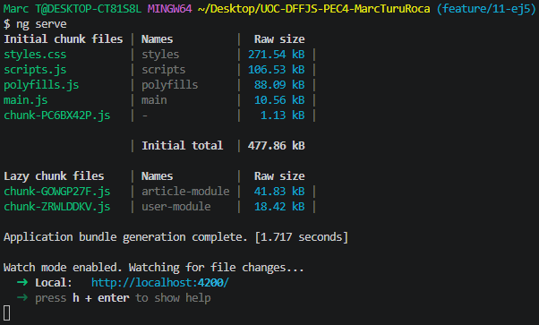
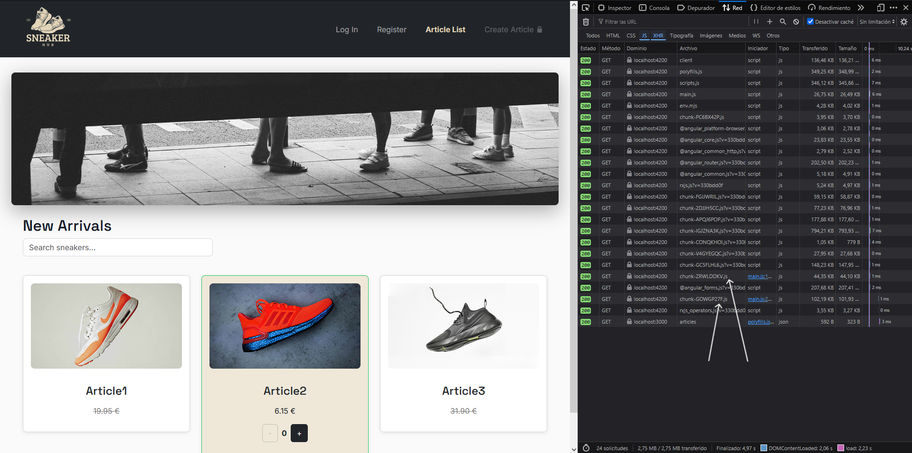
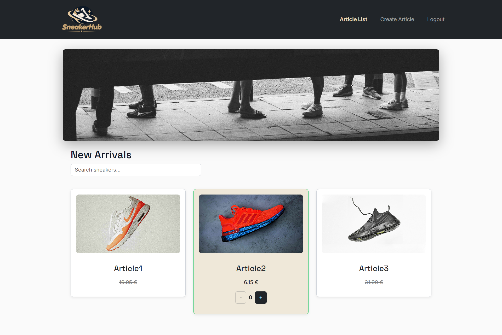
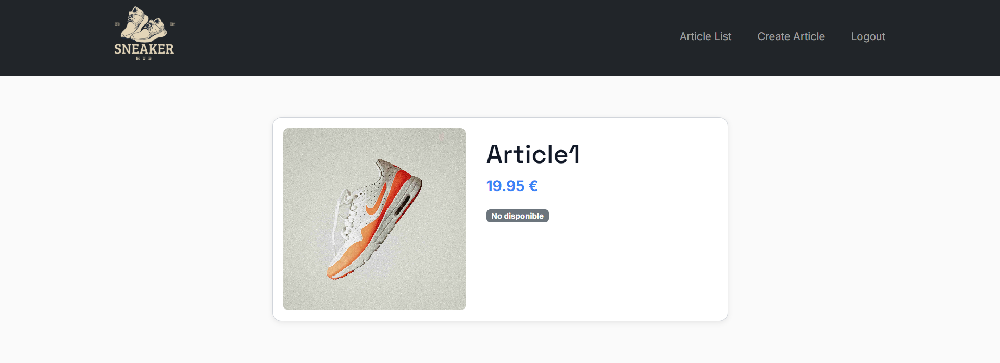
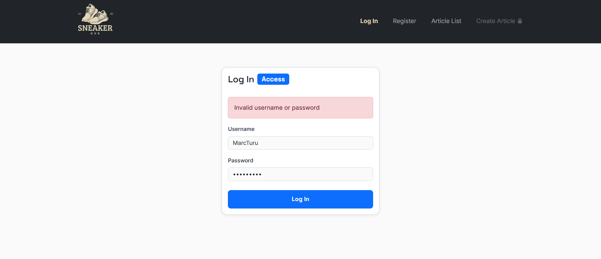
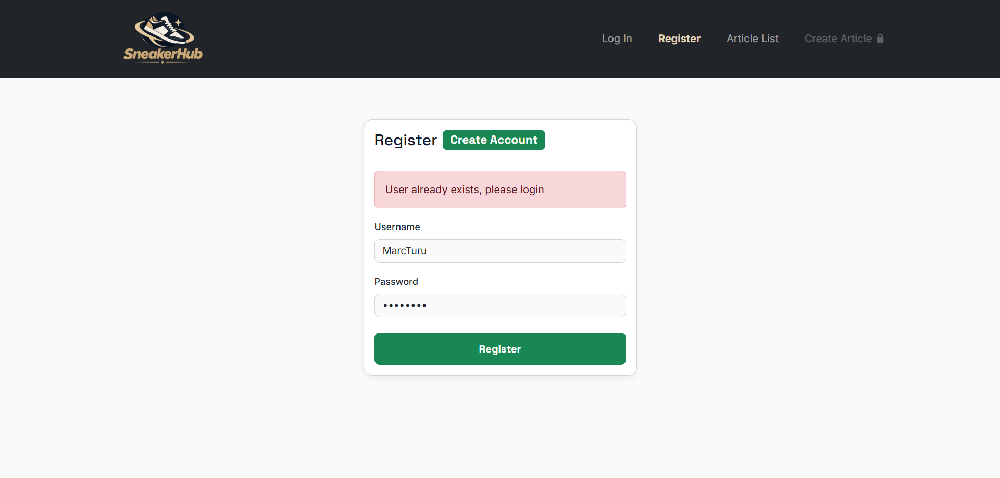

#  — Angular sneakers e-commerce


  
<sub>🗓️ Developed in June 2026</sub>

SneakerHub is an **Angular 17 e-commerce application** for browsing and managing a sneaker catalog.
It features **user authentication, reactive and template-driven forms, route protection, lazy loading and RxJS-based reactive data flows**, with a **Node.js + Express REST API** powering the backend.

## ✅ Features

### 🔐 Authentication
- **Login**: Reactive form with validation, error messages and redirect if already authenticated.
- **Register**: Reactive form with validation and error messages.
- **Remember login**: Session persistence across page reloads via `localStorage`.
- **Auth Guard**: Route `/article/create` protected and only accessible after login.
- **HTTP Interceptor**: Automatically attaches the `Authorization` header with the stored token to every outgoing request.

### 👟 Articles
- **Article list**: Product catalog fetched from a REST API with real-time search using `debounceTime` and `switchMap`.
- **Article detail**: Detail view for each product, accessible by clicking its image, navigated via Angular Router with route parameter `/:id`.
- **Article item**: Displays name, price, image and availability. Highlights on-sale items and shows quantity controls only when available.
- **Create article**: Reactive form with field validation, custom `NameArticleValidator` and POST to the REST API. *(Template form also available in code)*
- **Quantity control**: Real-time cart quantity update via PATCH requests, with automatic list refresh using `combineLatest` and `BehaviorSubject`.

### 🧱 Architecture
- **Angular services**: All business logic extracted from components into `ArticleService`, `UserService` and `UserStoreService`.
- **Lazy Loading**: `UserModule` and `ArticleModule` loaded on demand, reducing the initial bundle size.
- **RxJS**: Extensive use of `Observable`, `BehaviorSubject`, `Subject`, `switchMap`, `combineLatest`, `debounceTime` and `distinctUntilChanged`.
- **Async pipe**: Used throughout instead of manual subscriptions to avoid memory leaks.
- **OnPush change detection**: Applied to `ArticleItemComponent` for optimised rendering.

### 🎨 UI & Styling
- **Custom CSS variables**: Design system with tokens for colours, spacing, typography, shadows and breakpoints.
- **Bootstrap**: Used for `Navbar`, `Card`, grid layout and `Form` components.
- **Custom pipes**: `defaultImage` to show a fallback image when `imageUrl` is empty, and `price` for currency formatting.
- **Responsive grid**: Article list adapts to different screen sizes using Bootstrap's grid system.
- **Hero component**: Decorative hero section shown exclusively on the article list page.

---

## 🛠 Installation & Setup

### 1. Clone the repository
```bash
git clone https://github.com/marcturu/sneakerhub.git
cd sneakerhub
```

### 2. Client (Angular)
```bash
npm install
```

#### 2a. Development
```bash
ng serve
```
App available at `http://localhost:4200`.

#### 2b. Build
```bash
ng build
```
and check directory `dist/`.  

#### 2c. Tests
```bash
ng test
```
to execute unit tests from [Karma](https://karma-runner.github.io).  

```bash
ng ng e2e
```
to execute `end-to-end` tests from the chosen platform.  

> To use this command, it is necessary to include a package that implements the capability to perform *end-to-end* tests.

### 3. Server (NodeJS)
```bash
cd server-articles
npm install
npm start
```
Server available at `http://localhost:3000`.  

> For the application to function correctly, both the client and the server must be running simultaneously.

---

## 🔗 Available routes

### Web app (Client)
| Route | Description |
|--------|-------------|
| `/article/list` | Displays the product catalog. |
| `/article/:id` | Displays product details. |
| `/article/create` | Allows you to create a product. |
| `/login` | User login page. |
| `/register` | User registration page. |

### API REST (Server)
| Method | Endpoint | Description |
|---------|----------|-------------|
| GET | `/api/articles` | Retrieves all items. |
| GET | `/api/articles/:id` | Retrieves an item by identifier. |
| POST | `/api/articles/` | Creates a new item. |
| PATCH | `api/articles/:id` | Updates the **quantity** of an item. |
| POST | `/api/user/login` | Identifies an existing user. |
| POST | `/api/user/register` | Creates a new user. |

---

## 🎯 Exercises

> Exercises 1.1–1.7 were completed first, and then updated as part of the improvements made in exercises 2.1–2.5, so the file contents were updated as well.

### Exercise 1.1 - Installation and configuration
The version of Angular installed was **17**.

### Exercise 1.2 - First component in Angular
By using `[class]`, *property binding* could be applied to bind data
unidirectionally, assigning values from the controller (**.ts**) to the
view (**.html**).  
The global styles created were declared as:
```json
"styles": [
  "src/assets/styles/styles.css"
],
```
in `angular.json`.

### Exercise 1.3 - Directives in our project
`text-decoration: line-through;` was added (in addition to the grey colour)
to the **price** when the article was not available.

### Exercise 1.4 - Components in our project
To create the new component with *inline styles* and *templates*, the following
command was used (**Angular CLI**):
```bash
$ ng generate component components/article-list --inline-template --inline-style     
```
this way, the HTML and CSS were contained within `article-list.component.ts`
itself and all components were grouped under `/components`.

### Exercise 1.5 - Component review
The logic for choosing which view to display was declared in `app.component.ts`
with:
```ts
type ActiveView = 'list' | 'template' | 'reactive';
```
and a small **hero** component was added that was only shown on the home page
(in other words, the article list page).

### Exercise 1.6 - Template-driven forms
Even though **Template Forms** were used, *FormsModule* was added to
`app.module.ts` in order to use directives such as `ngModel` and `ngModelGroup`
in the *template*.  
To validate the **validity of a URL to locate a resource**, the following pattern
was included in the `ArticleNewTemplateComponent` class:
```ts
urlPattern = /^(?!.*\.\.)https?:\/\/[a-zA-Z0-9][a-zA-Z0-9\-._~:/?#[\]@!$&'()*+,;=%]*\.[a-zA-Z]{2,3}$/;
```
where `(?!.*\.\.)` specifically validated that ".." was not included in, for
example, **https://ejemplo..com**.  
This way, URLs following the pattern **http(s)://domain.xx(x)** were validated.

The following code included in the form *submit* used **false** as the default
value if *form.value.article.isOnSale* was **null** or **undefined**:
```ts
isOnSale: form.value.article.isOnSale ?? false
```  
Initially, a check was made to ensure the **price** was > 0, but since the next
exercise explicitly required this, and this one only stated that "The **price**
must be **numeric**", it was decided to remove this check for this case.  
Regardless, this could have been achieved with:
```html
<input ...
min="0.1">
<div class="invalid-feedback"
  *ngIf="priceField.errors?.['min'] && (priceField.dirty || priceField.touched || articleForm.submitted)">
  The price of the sneakers must be greater than 0
</div>
```

### Exercise 1.7 - Reactive forms
`src/app/validators/name-article.validator.ts` was created to implement a
custom validation and check the validity of the *name* field.  
To ensure that any combination of upper and lower case letters of those words
was not possible, `toLowerCase()` was applied to the **value** received as a
parameter in the function:
```ts
NameArticleValidator(control: AbstractControl): ValidationErrors | null
```
```ts
const forbidden = ['prueba', 'test', 'mock', 'fake'];
const value = control.value?.trim().toLowerCase();
```

_Form(s).png)
Fig. 1 - Articles created with **template** and **reactive** forms.

---

### Exercise 2.1 - Services
To create the new service, the following command was used (**Angular CLI**):
```bash
$ ng generate service services/article     
```
Initially (and before using server calls), `BehaviorSubject` was used to maintain
the current state of the articles and allow components to receive updates
automatically.  
Additionally, `article-list.component.ts` delegated all logic to the service and
`article-new-reactive.component.ts`, apart from returning a *console.log()*, called
the new function:
```ts
articleService.create()
```
to add the item from the form.

### Exercise 2.2 - HttpClient
In the function:
```ts
onQuantityChange(change: ArticleQuantityChange)
```
in `article-list.component.ts`, the parameter passed as **change** was previously
the new cart value. After inspecting the expected value in:
```js
router.patch('/:id', (req, res) => {}
```
on the server, it was confirmed that it expected how much to increment or
decrement, so the function, the **ArticleQuantityChange** model and the way
to modify the item value had to be changed:
```ts
increment(): void {
  this.quantityChange.emit({
    article: this.article,
    delta: 1
  });
}
```
For the search bar, **debounceTime(300)** was used to avoid overloading the
backend with HTTP calls on every keystroke, and **switchMap** to convert the
string into an HTTP request and cancel previous requests if a new one arrived.  

To keep the article list updated in real time after modifying a quantity, two
`Subject` instances were combined with `combineLatest`:
- `searchSubject`: emitted the search text with `debounceTime(300)` and
  `distinctUntilChanged` to avoid unnecessary requests.
- `refreshSubject` (`BehaviorSubject`): emitted an empty value every time a
  quantity `PATCH` completed, forcing a new `GET` to the server.  

This was necessary because the server managed the state (adding or subtracting
1 to `quantityInCart` on each PATCH), so the only way to have the updated
value was to request it again.

### Exercise 2.3 - Pipes
In the previous assignment, specifically in `article-item.component.html`, there
was already a *built-in* pipe:
```html
{{  article.price | currency:'EUR':'symbol':'1.2-2'}}
```
but for this exercise, two new custom pipes were generated with:
```bash
ng generate pipe pipes/default-image pipes/price
```

### Exercise 2.4 - Routing
`user.model.ts` was created to be used in, for example, typing **HTTP** call
data or the return types of `user.service.ts`:
```ts
export interface User {
  username: string;
  password: string;
}

export interface AuthResponse {
  msg: string;
  token: string;
}

export interface RegisterResponse {
  msg: string;
}
```
> To know exactly which types to use, the responses returned by each server
> call in `res.json({...})` had to be consulted.  

The following function was added to `article.service.ts` for use in
`article-detail.component.ts` to retrieve the article corresponding to its **id**:
```ts
getArticleById(id: number): Observable<Article> {
  return this.http.get<Article>(`${this.apiUrl}/${id}`);
} 
```  

The following was added to `article-item.component.html` (along with
`cursor: pointer`) to redirect the item to its `article-detail.component`:
```html
[routerLink]="['/article', article.id]"
```

From Angular +15 onwards, the class-based guard using **CanActivate** is
deprecated, so it was implemented as:
```ts
export const AuthGuard: CanActivateFn = () => {...}
```
and was not injected into the **providers** of `app.module.ts`, since it is
simply a function used directly in the route:
```ts
{ path: 'article/create', component: ArticleNewReactiveComponent, canActivate: [AuthGuard] },
```
in `app-routing.module.ts`.  

An HTTP interceptor (`article-app.interceptor.ts`) was implemented to
automatically add the Authorization header with the stored token whenever
the user was authenticated.  

In the navigation bar, `*ngIf="isLoggedIn$ | async"` was used to control which
options to display depending on whether the user was logged in or not, resulting
in two different navbar states:

   
Fig. 2 - Navigation bar without a logged-in user.  

   
Fig. 3 - Navigation bar with a logged-in user.  

The assignment stated that the `/user/register` endpoint automatically assigned
the password **SECRET** to all registered users. However, the provided server
implemented different behaviour and stored the password received in the request.  
Since the goal of the assignment was to consume the provided API, the client
application was adapted to the actual backend behaviour, sending and using the
password entered by the user during registration and authentication.

### Exercise 2.5 - Lazy Loading
The routes used in `user-routing.module.ts` were:
```ts
const routes: Routes = [
  { path: 'login', component: LoginComponent },
  { path: 'register', component: RegisterComponent }
];
```
and in `article-routing.module.ts`:
```ts
const routes: Routes = [
  { path: 'list', component: ArticleListComponent },
  { path: 'create', component: ArticleNewReactiveComponent, canActivate: [AuthGuard] },
  { path: 'create-template', component: ArticleNewTemplateComponent },
  { path: ':id', component: ArticleDetailComponent }
];
```  
Additionally, `app-routing.module.ts` had to be updated to use the new
**Angular +8** syntax with *dynamic import()*, and `app.module.ts` was cleaned
up to remove declarations already handled by each specific module.   

This way, the *login* and *register* routes were relative to the **User** module,
and the *article/list*, *article/create*, *article/:id* routes were relative to
the **Article** module. The prefix was set by the AppRoutingModule.  

It is worth noting that, apart from the view routes of each module, extra
components used by each page were also declared, for example in `article.module.ts`:
```ts
import { HeroComponent } from '../../components/hero/hero.component';
import { DefaultImagePipe } from '../../pipes/default-image.pipe';
import { PricePipe } from '../../pipes/price.pipe';
```

As can be verified by running:
```bash
$ ng serve
```
the files are generated with **lazy loading**, with **chunk-GOWGP27F.js** being
**article-module** and **chunk-ZRWLDDKV.js** being **user-module**:  

  

Fig. 4 - Lazy Loading shown in the console.  

and they are loaded correspondingly in the browser:  

  
Fig. 5 - Lazy Loading shown in Firefox Developer DevTools.  

This separation meant that the user and article modules were only downloaded
when needed, reducing the size of the initial *bundle*.

--- 

## ⚠️ Considerations

- Articles and users are stored in memory on the server (so restarting the
  *client* (frontend) does not affect the data).
- However, restarting the *server* (backend) causes all created data to be lost.

---

## 📷 Screenshots 

### Article list:


### Article item:


### Create article (*reactive form*):
.png)

### Login:


### Register:

